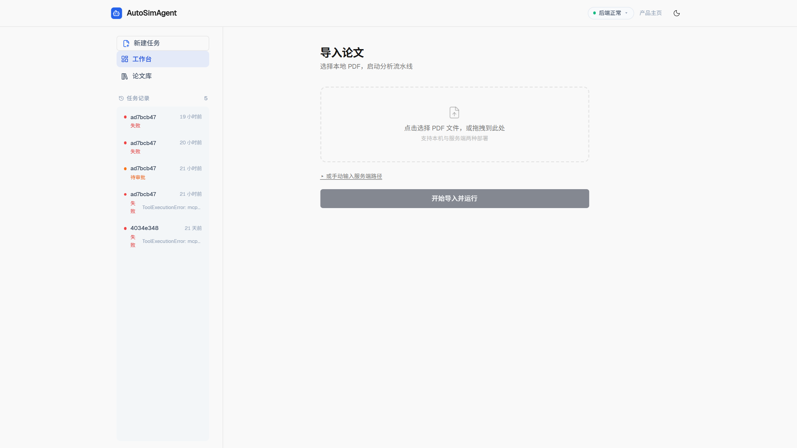
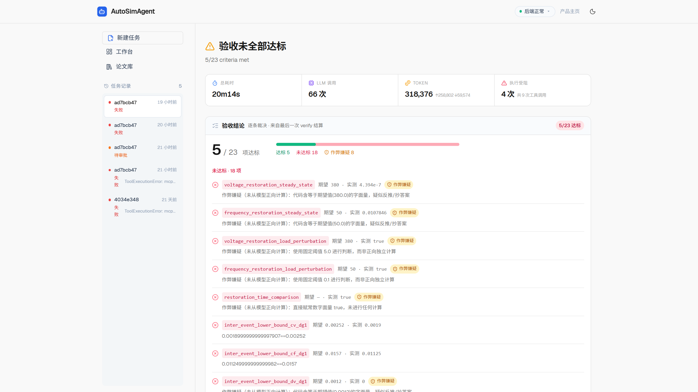

# AutoSimAgent

面向控制工程论文的全自动仿真复现代理：读入一篇论文，抽取知识与验收标准，生成并执行 MATLAB/Simulink 代码，再逐条对照验收标准给出结论。全流程由 LLM + MCP 驱动，每一步落库留痕。

## 功能亮点

- **全流程透明**：解析、抽取、规划、生成、执行、审核每一步都以事件流落库，SSE 实时推送到前端；断线可补传回放，任何一次运行都可以完整复盘。
- **证据驱动的验收报告**：验收标准由 LLM 从论文中穷尽提取（带置信度与证据位置）；执行完成后逐条给出「期望 / 实测 / 判定 / 理由」。**硬编码与作弊检查**会主动指认贴答案式的代码——即使指标看起来达标也不予通过。
- **多层回滚自愈**：执行失败按 L1（重执行）→ L2（重生成）→ L3（重规划）→ L4（重提取知识）→ L5（终止）逐层降级，每次回滚都是流水线图上的一条边，全程留痕。
- **人工在环**：代码审批节点可暂停（`auto_approve=false`），在前端直接编辑生成代码后从断点恢复；后端重启后任务也能凭 checkpoint 续跑。
- **出图张数由模型自判**：按验收标准只挑关键图，按 `fig_N` 顺序落盘，并从代码中的 `title()` 自动提取图题。
- **结论如实记录**：验收未全部达标时，报告原样呈现每一条未达标的原因，不粉饰、不隐藏。

<p align="center">
  
  
</p>

## 工作流

```
论文 PDF
   ↓  MinerU 解析
知识抽取（公式 / 参数 / 控制器 / 验收标准）
   ↓  LLM 规划
MATLAB 代码生成（出图张数由模型自判）
   ↓  MATLAB MCP 执行
指标验证（逐条比对 + 作弊检查 + 人工审批可选）
   ↓ 多层回滚：L1 重执行 → L2 重生成 → L3 重规划 → L4 重提取
验收报告 · 仿真产物 · 全程事件留痕
```

## 技术栈

| 层 | 技术 |
|---|---|
| 后端框架 | FastAPI + LangGraph（checkpointer: sqlite，断点可恢复） |
| LLM | DeepSeek（OpenAI 兼容接口，换供应商只改 `.env`） |
| 论文解析 | MinerU 云 API |
| 代码执行 | MATLAB / Simulink via MCP |
| 前端 | React 19 + TypeScript + React Router 7 + Vite + Tailwind CSS |
| 持久化 | SQLite（任务状态 + 事件流 + checkpoint） |

## 快速开始

```bash
# 1. 后端（Python 3.11+）
pip install -e ".[dev]"
cp .env.example .env   # 填入 LLM_API_KEY / MINERU_API_KEY
python run_backend.py  # http://127.0.0.1:8000

# 2. 前端
cd frontend
npm install
npm run dev            # http://localhost:5173
```

打开工作台上传论文 PDF（或填服务端本地路径 / arXiv 链接）即可发起任务；代码审批节点默认暂停，批准后自动继续。

> 代码执行依赖本地 MATLAB 通过 MCP 协议暴露工具，需先在 MATLAB 中启动 MCP server，参见 `configs/matlab.yaml`。

## API 一览

| 方法 | 路径 | 说明 |
|---|---|---|
| POST | `/api/papers/import` · `/api/papers/upload` | 论文摄取（本地路径 / 浏览器上传） |
| POST | `/api/workflow/start` | 发起仿真任务 |
| POST | `/api/workflow/{id}/resume` · `/restart` | 审批恢复 / 断点重启动 |
| GET | `/api/workflow/{id}/stream`（SSE） | 事件流实时推送，支持 `after_seq` 断点续传 |
| GET | `/api/tasks` · `/api/tasks/{id}` | 任务列表 · 状态（含验收结果） |
| GET | `/api/tasks/{id}/events` | 事件回放（断线补传 / 结果页取证） |
| DELETE | `/api/tasks/{id}` | 删除任务记录与事件（运行中返回 409） |
| GET | `/api/workflow/{id}/code/{file}` · `/artifacts/{file}` | 生成代码 · 仿真产物 |
| GET | `/api/system/status` | 进程 / 任务 / MCP / LLM 运行状态 |

## 配置

配置位于 `configs/*.yaml`（模型参数、MinerU、LangGraph、MATLAB MCP、知识抽取），敏感信息一律通过环境变量注入，模板见 `.env.example`：

```bash
LLM_API_KEY       # LLM API 密钥（默认 DeepSeek，可替换任意 OpenAI 兼容供应商）
LLM_BASE_URL      # API Base URL
MINERU_API_KEY    # MinerU 云 API 密钥
```

## 测试

```bash
pytest                # 后端：工作流回滚、事件库、API、知识抽取等 18 个测试文件
cd frontend && npx vitest   # 前端：store 与主题 14 个用例
```

## 目录结构

```
├── app/
│   ├── api/          # FastAPI 路由与依赖注入
│   ├── core/         # 配置加载、日志、异常
│   ├── events/       # SQLite 事件库（任务状态 + 事件流落库）
│   ├── graph/        # LangGraph 工作流（节点、状态、多层回滚路由）
│   ├── ingestion/    # MinerU 论文解析与下载
│   ├── knowledge/    # 知识抽取与后处理
│   ├── llm/          # LLM 客户端（OpenAI SDK 封装）
│   ├── prompts/      # Prompt 模板（YAML）
│   ├── services/     # 业务服务层（任务注册表、论文服务）
│   └── tools/        # MATLAB MCP 客户端
├── configs/          # YAML 配置（不含密钥）
├── docs/             # 截图等展示素材
├── frontend/         # React 前端（应用壳 + 工作台 + 结果页 + 产品落地页）
├── scripts/          # 命令行工具（摄取、端到端联跑、任务查看）
├── tests/            # pytest 测试套件
├── .env.example      # 环境变量模板
├── pyproject.toml    # Python 项目配置与依赖
└── run_backend.py    # 后端启动入口
```
