# Distributed Consensus-Based Secondary Control for Islanded Microgrids with Communication Time-Delays

Yadong Zhu\*,#

Huaqiao University

Xiamen, China

\*13233783359@163.com

Changcheng Yu#

China University of Mining and Technology-Beijing

Beijing, China

#These authors contributed equally.

Abstract—Against the backdrop of complex control and management requirements, the development of microgrids (MGs) faces severe challenges. To effectively address the frequency restoration and active power sharing in MGs under dynamic environments, this paper proposes a distributed secondary control (DSC) based on the consensus protocol of multi-agent systems. This method decentralizes the control logic to each distributed generator and achieves global coordinated through sparse communication among adjacent nodes, significantly enhancing the flexibility of secondary control. Different from traditional distributed control strategies that merely assume ideal communication conditions, this paper derives the system's communication time-delays (CTDs) margin through frequency-domain analysis, and strictly proves the convergence of the system by combining Lyapunov stability theory, providing a quantitative basis for handling communication delays in practical engineering applications. Finally, simulations verify the effectiveness, robustness of the proposed DSC in terms of frequency restoration and active power sharing, as well as the correctness of the theory, and also demonstrate the impact of different CTDs on control performance.

Keywords—islanded MGs, distributed secondary control, communication time-delay, Lyapunov stability theory, frequencydomain analysis method

## I. INTRODUCTION

Nowadays, with the rapid development of renewable energy, microgrids (MGs) have gradually become an important research field due to their flexibility and reliability [1-3]. However, the deployment of a large number of highly random and volatile distributed generators (DGs) (such as photovoltaic (PV) and wind turbines) poses higher requirements for the stable operation of MGs. To address this issue, the hierarchical control architecture has been introduced [4,5], which achieves efficient system management by dividing control functions into three layers. In this architecture, the primary control and secondary control serve as core components, respectively undertaking basic control and global optimization tasks to form a collaborative control system with clear division of labor.

The primary control serves as the bottom-level control unit of MGs, primarily responsible for local real-time power sharing and fast dynamic response. Taking the typical droop control as an example, it simulates the frequency-active power and voltage-reactive power droop characteristics of synchronous generators, enabling each distributed generator (DG) to autonomously respond to load changes and achieve preliminary power sharing [6, 7]. As the upper-level regulation unit, the secondary control layer focuses on system-level global optimization and deviation correction. By collecting system-wide state information such as frequency and voltage, it generates compensation signals based on control algorithms to adjust the parameters of the primary control, thereby achieving frequency restoration and precise active power sharing [8-12].

Existing secondary control strategies fall into two categories: centralized and distributed architectures. Centralized control relies on a central controller to process global communication data, yet suffers from single-point failure risks and has poor compatibility for plug-and-play, thereby compromising system security and stability [13-15]. In contrast, distributed secondary control (DSC) achieves cooperative regulation through localized information exchange between neighboring nodes, significantly enhancing system robustness against failures. Its inherent adaptability to topology reconfiguration makes distributed approaches particularly suitable for dynamic MGs environments, establishing them as a prevailing research focus [16-19].

DSC in MGs requires coordinated operation of multiple DGs through communication networks. Current studies often idealize network conditions, neglecting the critical impact of communication time-delays (CTDs) For instance, reference [20] employs a hierarchical observer with model predictive control for rapid frequency restoration in PV-rich scenarios, while reference [21] proposes a data-driven frequency control scheme using maximum entropy deep reinforcement learning. However, neither adequately addresses the compounded effects of realistic communication delays on distributed coordination.

In MGs system, CTDs are inevitable and non-negligible due to the inherent communication delays between components and the physical constraints of system dynamic response, which collectively impede instantaneous information transfer and system-wide coordination. Under distributed architectures, such delays may cause data asynchrony, leading to localized overshoot/undershoot, sustained oscillations, and even system instability [22-24] . When coupled with cyberattacks, CTDs can amplify instability risks by disrupting cooperative control mechanisms [25-27]. Consequently, communication timedelay (CTD) mitigation has emerged as a pivotal challenge impeding MGs deployment, demanding proactive modeling and compensation strategies as essential technical breakthroughs for next-generation smart MGs.

This paper proposes a DSC that achieves precise frequency restoration and active power sharing within the CTD margin. A consensus protocol algorithm with delay awareness is designed, whose convergence and stability are analyzed based on Lyapunov stability theory, and the system’s CTD margin is derived using frequency-domain analysis methods. For simulation verification, a Matlab/Simulink-based environment is constructed to set up multiple scenarios for investigating the impact of delays on system convergence and the compatibility of the control algorithm for plug-and-play, providing a robust foundation for practical engineering applications.

The structure of this paper is organized as follows: Section 1 introduces the research background and delayrelated challenges in DSC; Section 2 presents relevant theoretical foundations and formulates control objectives; Section 3 details the distributed secondary control design and completes the stability analysis; Section 4 verifies the control performance under multiple delay scenarios via Matlab/Simulink simulations; Section 5 summarizes the research and outlines future research directions.

Notation. $\mathbf { R } ^ { N }$ is the set of $N { \times } 1$ real column vectors and $\mathbf { R } ^ { N \times N }$ is the set of $N \times N$ real matrices. $\mathbf { 1 } _ { N } ^ { T }$ represents an -dimensional column vector with all elements being 1. represents the set of integers. $\operatorname { R e } ( s ) / \operatorname { I m } ( s )$ means the real/imaginary part of the complex number  .

## II. PRELIMINARIES AND CONTROL OBJECTIVES

In this section, we present the preliminary knowledge required for subsequent analysis and formulate the control objectives.

## A. Graph Theory

We employ an undirected graph to characterize the communication network involving interactions among multiple DGs. In this undirected graph, nodes represent all DGs, while edges represent information flow. The graph is denoted as $G = \{ V , E , A \}$ , where the node set $V = \{ 1 , . . . , N \}$ the edge set is denoted by  , and $E \subseteq V \times V$ . The adjacency matrix $\boldsymbol { A } = [ a _ { i j } ] \in \mathbf { R } ^ { N \times N }$ describes the relationships between nodes: if $( j , i ) \in E$ , nodes  and  can mutually access information. The neighbor set of nodes  is defined as $N _ { \ i } = \{ j \vert ( j , i ) \in E \}$ When $( j , i ) \in E$ the weight $a _ { i j } = a _ { j i } = 1$ ; otherwise, $a _ { i j } = 0$ . The corresponding Laplacian matrix ${ \cal L } = [ a _ { i j } ] \in { \bf R } ^ { N \times N }$ , where $l _ { i i } = \sum _ { j = 1 , j \neq i } ^ { N } a _ { i j }$ and $l _ { i j } = - a _ { i j } ( i \neq j )$ . The pinning matrix $B = \mathrm { d i a g } [ b _ { 1 } , . . . , b _ { { \scriptscriptstyle N } } ]$ indicates the reception of reference node signals by all nodes, where reference node is generally set as the reference point for the system's rated voltage and rated frequency. If node  can directly receive the reference signal, $b _ { i } = 1$ ; otherwise, $b _ { i } = 0$

Definition 1: For any two nodes i and  in the graph, there exists a path composed of edges to connect  and $j$ then the undirected graph  is said to be connected.

Assumption 1: The undirected graph G is connected, and

at least one node can receive information from reference node.

Lemma 1: If Assumption 1 holds, the Laplacian matrix L has eigenvalues $0 = \lambda _ { 1 } < \lambda _ { 2 } \leq \cdots \lambda _ { N }$ , and there exists $z ^ { T } L z \ge \lambda _ { 2 } z ^ { T } z > 0$ for $z \in { \mathbf { R } } ^ { N }$ satisfying $\mathbf { 1 } _ { N } ^ { T } z = 0$ ; matrix $M = L + B$ is positive definite.

## B. MGs Structure and Control loop

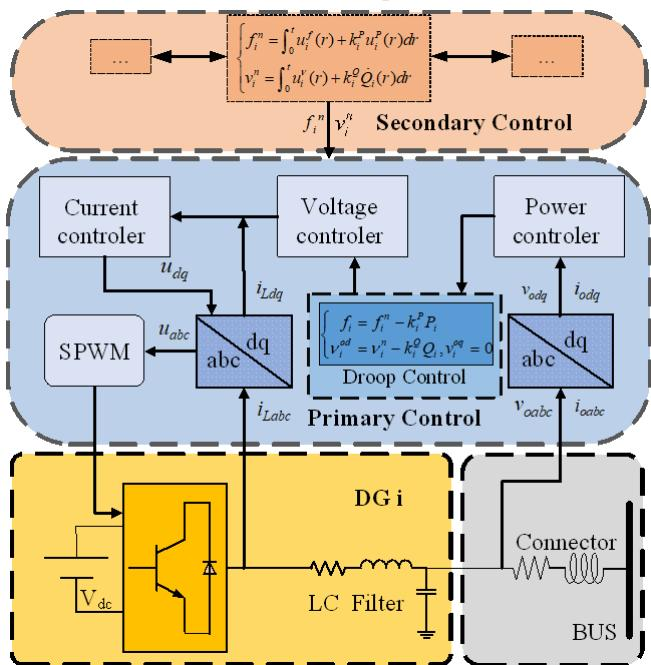  
Fig. 1. Schematic diagram of primary and secondary

As shown in Fig. 1, the microgrid (MG) is primarily composed of DGs, power conversion units, filter units, control units, etc. Primary control serves as the local autonomous layer, where each distributed generator (DG) operates independently, quickly responding to load changes through droop control to maintain local power balance, and its equation is

$$
\left\{ \begin{array} { l l } { f _ { i } = f _ { i } ^ { n } - k _ { i } ^ { P } P _ { i } , } \\ { \nu _ { i } ^ { o d } = \nu _ { i } ^ { n } - k _ { i } ^ { Q } \mathcal { Q } _ { i } , \nu _ { i } ^ { o q } = 0 . } \end{array} \right.\tag{1}
$$

where $f _ { i }$ is the frequency of node $i , \nu _ { i } ^ { o d }$ and $\nu _ { i } ^ { o q }$ are the $d$ - axis and $q$ - axis voltages respectively, $f _ { i } ^ { n }$ and $ { \boldsymbol \nu } _ { i } ^ { n }$ represent the reference voltage and reference angular frequency respectively, $k _ { i } ^ { P }$ and $k _ { i } ^ { \mathcal { Q } }$ represent the reactive droop coefficient and active droop coefficient respectively. Since $\nu _ { i } = \sqrt { ( \nu _ { i } ^ { o d } ) ^ { 2 } + ( \nu _ { i } ^ { o q } ) ^ { 2 } }$ , so in the following text, $\nu _ { _ i }$ is used to replace $\nu _ { i } ^ { o d }$ . Therefore, the primary control of the system can be expressed as

$$
\left\{ \begin{array} { l l } { f _ { i } = f _ { i } ^ { n } - k _ { i } ^ { P } P _ { i } , } \\ { \nu _ { i } = \nu _ { i } ^ { n } - k _ { i } ^ { Q } Q _ { i } . } \end{array} \right.\tag{2}
$$

Taking the derivative of (2) with respect to time, we can obtain

$$
\left\{ \begin{array} { r } { \dot { f } _ { i } = u _ { i } ^ { \omega } , } \\ { k _ { i } ^ { P } \dot { P } _ { i } = u _ { i } ^ { P } , } \end{array} \right.\tag{3}
$$

where $u _ { i } ^ { f }$ and $u _ { i } ^ { P }$ are the DSC to be designed. By transforming and integrating (3) , we can obtain

$$
f _ { i } ^ { n } = \int _ { 0 } ^ { t } u _ { i } ^ { f } ( r ) + u _ { i } ^ { P } ( r ) d r ,\tag{4}
$$

where $f _ { i } ^ { n }$ is the frequency correction quantities output by the secondary control of the i -th DG. Through an integrator, the steady-state frequency deviations caused by the primary control are eliminated, and the correction quantities are fed back to the primary control loop as reference quantities to achieve frequency synchronization across the entire network as shown in Fig. 1.

## C. Control Objectives

The main objectives of this paper include:

1) Frequency restoration:

$$
\operatorname* { l i m } _ { t  + \infty } \mid f _ { i } - f _ { r e f } \mid = 0 , i = 1 , 2 , \cdots N ,\tag{5}
$$

where $f _ { r e f }$ is the frequency of system.

2) Active power sharing:

$$
\operatorname * { l i m } _ { t  + \infty } \mid k _ { i } ^ { P } P _ { i } - k _ { j } ^ { P } P _ { j } \mid = 0 , i , j = 1 , 2 , \cdots N .\tag{6}
$$

## III. CONTROLLER DESIGN AND STABILITY ANALYSIS

In this section, we introduce the design process of the controller, conduct convergence analysis, and preliminarily explore the impact of CTDs on control performance.

## A. Frequency Restoration

To eliminate the frequency deviation caused by primary control and restore the system to the rated frequency, we introduce a consensus protocol: $\textstyle \sum _ { j = 1 } ^ { N } a _ { i j } ( f _ { j } - f _ { i } )$ , forcing adjacent-node frequencies to synchronize. Meanwhile, a reference tracking term $b _ { i } ( f _ { r e f } - f _ { i } )$ is introduced, where $f _ { r e f }$ is the frequency of the reference node, to ensure that the system finally tracks the global reference value. Therefore, the DSC for frequency restoration is formulated as

$$
\begin{array} { r } { u _ { i } ^ { f } = m _ { f } ( \sum _ { j = 1 } ^ { N } a _ { i j } ( f _ { j } - f _ { i } ) + b _ { i } ( f _ { r e f } - f _ { i } ) ) , } \end{array}\tag{7}
$$

where $m _ { f } > 0$ is the frequency-control gain.

Theorem 1: Under Assumption 1 and DSC (7) , the global frequency error converges to zero, that ${ \mathrm { i } } \mathbf { s } ,$ the frequency restoration of system can be realized.

Proof: Define the global frequency-error vector $e _ { f } = [ f _ { 1 } - f _ { \mathrm { r e f } } , . . . , f _ { N } - f _ { \mathrm { r e f } } ] ^ { T }$ and $\boldsymbol { f } = [ f _ { 1 } , . . . , f _ { N } ] ^ { T }$ . we can obtain

$$
\dot { \boldsymbol { f } } = - m _ { f } \left( \boldsymbol { L } + \boldsymbol { B } \right) \boldsymbol { e } _ { f } = - m _ { f } \boldsymbol { M } \boldsymbol { e } _ { f } ,\tag{8}
$$

where matrix is positive definite according to Lemma 1. Construct a Lyapunov function as

$$
V = \frac { 1 } { 2 } e _ { f } ^ { T } e _ { f } .\tag{9}
$$

Taking the derivative with respect to time yields

$$
\dot { V } = e _ { f } ^ { T } \dot { e } _ { f } = e ^ { T } \dot { f } = - m _ { f } e _ { f } ^ { T } M e _ { f } < 0 .\tag{10}
$$

It follows from the Lyapunov stability theory that lim $V = 0 ~ , ~ \mathrm { i . e . , } ~ \operatorname * { l i m } _ { t  + \infty } | \ f _ { i } - \stackrel { . } { f _ { r e f } } | = 0 , \forall i = 1 , \stackrel { . } { 2 } , \cdots N$ . As a t→+∝ result, the frequency restoration is realized under DSC (7) .

## B. Active Power Sharing

In MGs, DGs sharing active power according to capacity proportion is a core principle to ensure the safe, stable, and economic operation of the system, which can balance equipment utilization and effectively reduce costs. To meet the droop characteristics (2) while achieving frequency restoration, the active power sharing needs to satisfy the condition $k _ { i } ^ { P } P _ { i } = k _ { j } ^ { P } P _ { j }$ , and the DSC for active power sharing is designed as

$$
\begin{array} { r } { u _ { i } ^ { P } = m _ { P } \sum _ { j = 1 } ^ { N } a _ { i j } ( k _ { j } ^ { P } P _ { j } - k _ { i } ^ { P } P _ { i } ) , } \end{array}\tag{11}
$$

where $m _ { p } > 0$ is the active power – control gain.

Theorem 2: Under Assumption 1 and DSC (11), the active power sharing can be realized.

Proof: Define the active power sharing error vector

$$
e _ { P } = ( k _ { i } ^ { P } P _ { i } - \frac { 1 } { N } { \sum } _ { i = 1 } ^ { N } k _ { i } ^ { P } P _ { i } , . . . , k _ { N } ^ { P } P _ { N } - \frac { 1 } { N } { \sum } _ { i = 1 } ^ { N } k _ { i } ^ { P } P _ { i } ) ^ { T }
$$

satisfying $\mathbf { 1 } _ { N } ^ { T } e _ { P } = 0$ and $\boldsymbol { k } ^ { P } = [ k _ { 1 } ^ { P } P _ { 1 } , . . . , k _ { N } ^ { P } P _ { N } ]$ . We can obtain

$$
k ^ { P } \dot { P } = - m _ { P } L e _ { P } .\tag{12}
$$

Construct a Lyapunov function as

$$
V = \frac { 1 } { 2 } e _ { P } ^ { T } e _ { P } .\tag{13}
$$

Taking the derivative with respect to time yields

$$
\dot { V } = e _ { P } ^ { T } \dot { e } _ { P } = e _ { P } ^ { T } k ^ { P } \dot { P } = - m _ { p } e _ { P } ^ { T } L e _ { P } \leq - m _ { p } \lambda _ { 2 } e _ { P } ^ { T } e _ { P } < 0 , ( 1 4 )
$$

where $\lambda _ { 2 }$ is the second-smallest eigenvalue of Laplacian matrix , it follows from Lemma 1 that (14) holds. That is, the active power sharing is realized.

## C. Controller Design with CTDs

In practice, the state information of nodes needs to experience a CTD before being transmitted to adjacent nodes. Taking frequency restoration as an example, considering a fixed CTD, DSC (7) is modified as

$$
\begin{array} { l } { \dot { f } _ { i } = m _ { f } ( \sum _ { j = 1 } ^ { N } a _ { i j } ( f _ { j } ( t - \tau ) - f _ { i } ( t - \tau ) ) } \\ { \quad \ + b _ { i } ( f _ { r e f } - f _ { i } ( t - \tau ) ) ) . } \end{array}\tag{15}
$$

Theorem 3: There exists a delay margin $\tau _ { \mathrm { m a x } }$ such that when the communication delay $\tau \leq \tau _ { \operatorname* { m a x } }$ , the system states can still achieve consensus and maintain system stability.

Proof: When considering communication delays, the frequency error vector becomes

$$
e _ { _ { f i } } ( t - \tau ) = f _ { i } ( t - \tau ) - f _ { _ { r e f } } .\tag{16}
$$

Considering communication CTDs, (8) becomes

$$
\dot { \boldsymbol { f } } = - m _ { f } M \boldsymbol { e } ( t - \tau ) .\tag{17}
$$

Perform Laplace transform on the dynamic equation, and obtain

$$
s E _ { f } ( s ) = - m _ { f } M e ^ { - s \tau } E _ { f } ( s ) .\tag{18}
$$

Thus, the characteristic equation is obtained:

$$
d e t ( s I + m _ { f } M e ^ { - s \tau } ) = 0 .\tag{19}
$$

Stability condition: The real part of all characteristic roots needs to satisfy $ { \mathrm { R e } } ( s ) < 0$ , that is, the system is stable in the left-half plane of the complex plane.

Decompose the characteristic equation into a singlevariable form, and each eigenvalue $\lambda _ { i }$ of matrix M corresponds to

$$
s + m _ { f } \lambda _ { i } e ^ { - s \tau } = 0 .\tag{20}
$$

When the system is critically stable, the characteristic root $s = j \omega$ (on the imaginary axis), substituting it in, we get

$$
j \omega + m _ { f } \lambda _ { i } e ^ { - j \omega \tau } = 0 .\tag{21}
$$

Transform the equation into

$$
e ^ { - j \omega \tau } = - \frac { j \omega } { m _ { f } \lambda _ { i } } .\tag{22}
$$

By the amplitude condition (the magnitudes on both sides of the equation need to be equal) and the phase condition (the phases on both sides of the equation need to be equal or differ by $2 k \pi )$ , the following system of equations can be obtained:

$$
\left\{ \begin{array} { l } { \displaystyle { \big | e ^ { - j \omega \tau } \big | = \big | - \frac { j \omega } { m _ { f } \lambda _ { i } } \big | , } } \\ { \displaystyle { - \omega \tau = - \frac { \pi } { 2 } + 2 k \pi ( k \in { \bf Z } ) . } } \end{array} \right.\tag{23}
$$

By solving simultaneously, the critical CTD is obtained:

$$
\tau _ { { i } } = \frac { \pi } { 2 k _ { f } \lambda _ { i } } - \frac { 2 k \pi } { k _ { f } \lambda _ { i } } .\tag{24}
$$

Take the smallest positive solution $k = 0$ , calculate the corresponding critical CTD $\tau _ { i }$ for all eigenvalues $\lambda _ { i }$ , and obtain the CTD margin of the frequency controller:

$$
\tau _ { \mathrm { m a x } } = \frac { \pi } { 2 m _ { f } \lambda _ { \mathrm { m a x } } } ,\tag{25}
$$

where $\lambda _ { \operatorname* { m a x } }$ is the maximum eigenvalue of matrix . Similarly, we can also obtain the CTD margin of the activepower sharing controller, which depends on the active- power gain $m _ { P }$ and the maximum eigenvalue of the Laplacian matrix L . This indicates that when $\tau < \tau _ { \mathrm { m a x } }$ , the characteristic roots of equation (21) are located in the lefthalf plane of the complex plane, the system is stable, providing a clear constraint for the controller parameter design.

In summary, when the CTD is less than the CTD margin, the designed controller can achieve the control objectives 1 and 2. The above conclusions indicate that they provide clear constraints for controller parameter design.

## IV. SIMULATION

In this section, we utilize an AC islanded MG model on the Matlab/Simulink R2023b platform for simulation to verify the effectiveness, robustness of the DSC algorithm. The MG system consists of five DGs, six loads (including five fixed loads and one switchable load), and transmission lines. The relevant parameters of the MG are shown in TABLE I. The corresponding MG structure and communication topology are shown in Fig. 2. Only DG 1 can receive the reference signal, with a system frequency of $f ^ { \mathrm { r e f } } = 5 0$ . Meanwhile, the corresponding Laplacian matrix  and pinning matrix B are as follows:

$$
\begin{array} { r } { \mathrm { L } = \left[ \begin{array} { c c c c c } { 2 } & { - 1 } & { 0 } & { 0 } & { - 1 } \\ { - 1 } & { 2 } & { - 1 } & { 0 } & { 0 } \\ { 0 } & { - 1 } & { 2 } & { - 1 } & { 0 } \\ { 0 } & { 0 } & { - 1 } & { 2 } & { - 1 } \\ { - 1 } & { 0 } & { 0 } & { - 1 } & { 2 } \end{array} \right] , ~ B = \left[ \begin{array} { c c c c c } { 1 } & { 0 } & { 0 } & { 0 } & { 0 } \\ { 0 } & { 0 } & { 0 } & { 0 } & { 0 } \\ { 0 } & { 0 } & { 0 } & { 0 } & { 0 } \\ { 0 } & { 0 } & { 0 } & { 0 } & { 0 } \\ { 0 } & { 0 } & { 0 } & { 0 } & { 0 } \\ { 0 } & { 0 } & { 0 } & { 0 } & { 0 } \end{array} \right] . } \end{array}
$$

By taking $m _ { \it f } = 5 0 \ , \ m _ { \it P } = 5 0$ , and using Equation (25) , the CTD margin of the frequency controller $\tau _ { \operatorname* { m a x } } \left( f \right) = 7 . 6$ and the CTD margin of the active power controller $\tau _ { \mathrm { m a x } } \left( P \right) = 8 . 7$ . For convenience, we take $\tau _ { \operatorname* { m a x } } \left( f \right)$ as the global CTD margin.

TABLE I. PARAMETERS OF THE MG
<table><tr><td></td><td>DG1</td><td>DG2</td><td>DG3</td><td>DG4</td><td>DG5</td></tr><tr><td> $V _ { d c } ( \mathrm { V } )$ </td><td></td><td></td><td>700.0</td><td></td><td></td></tr><tr><td> $k ^ { f } \times 1 0 ^ { - 5 }$ </td><td>6.0</td><td>6.0</td><td>6.0</td><td>6.0</td><td>6.0</td></tr><tr><td> $k ^ { P } \times 1 0 ^ { - 3 }$ </td><td>4.2</td><td>4.2</td><td>4.2</td><td>4.2</td><td>4.2</td></tr><tr><td> $R _ { c } \left( \Omega \right)$ </td><td></td><td></td><td>0.05</td><td></td><td></td></tr><tr><td> $L _ { c } \left( \mathrm { m H } \right)$   $R _ { f } \left( \Omega \right)$ </td><td></td><td></td><td>0.35</td><td></td><td></td></tr><tr><td></td><td></td><td></td><td>0.10</td><td></td><td></td></tr><tr><td> $L _ { f } \left( \mathrm { m H } \right)$ </td><td></td><td></td><td>3.50</td><td></td><td></td></tr><tr><td> $C _ { f } \left( \mu \mathrm { F } \right)$ </td><td></td><td></td><td>50.0</td><td></td><td></td></tr><tr><td></td><td>Load 1</td><td>Load 2</td><td>Load 3</td><td>Load</td><td>Load 6</td></tr><tr><td>P(kW)</td><td>12.0</td><td>10.0</td><td>8.5</td><td>4&amp;5 15.0</td><td>16.0</td></tr><tr><td>Q(kVar)</td><td>6.0</td><td>5.5</td><td>5.2</td><td>6.5</td><td>12.0</td></tr><tr><td></td><td>Line 1</td><td>Line 2</td><td></td><td>Line 3</td><td>Line 4</td></tr><tr><td> $R _ { L } \left( \Omega \right)$ </td><td></td><td></td><td></td><td></td><td></td></tr><tr><td> $L _ { L } ( \mathrm { m H } )$ </td><td></td><td></td><td>0.10</td><td></td><td></td></tr></table>

Notations. $V _ { d c }$ represents the internal DC-bus voltage of DGs; $R _ { c }$ and $L _ { c }$ are the connector resistance and inductance between DGs and the bus; $R _ { f }$ , $L _ { f }$ and $C _ { f }$ are the filter parameters within DGs; $R _ { L }$ and $L _ { \ L _ { L } }$ represent the line resistance and inductance respectively.

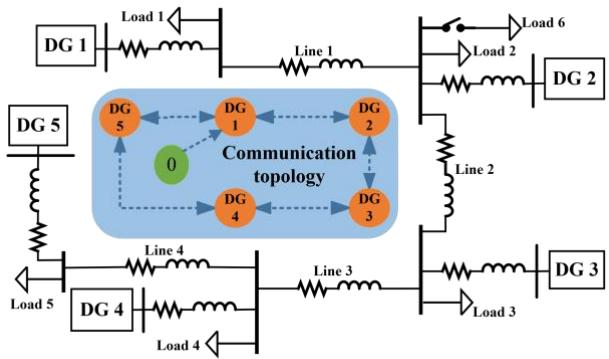  
Fig. 2. The structure of the AC islanded MGs.

## Scenario 1: Control Performance without CTDs.

As shown in Fig. 3, in the scenario without CTDs, the system operates only relying on droop control in the initial 3 s . At the , the DSC is enabled. This controller can coordinate each DG to achieve frequency restoration and active power sharing, thus verifying the effectiveness of the DSC. To further verify the robustness, it is set that Load 6 is disconnected at  and reconnected at , so as to simulate the load-mutation condition.

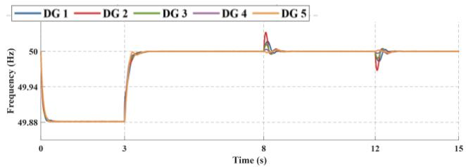  
(a) Frequency restoration

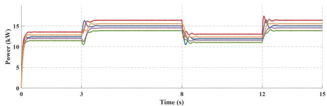

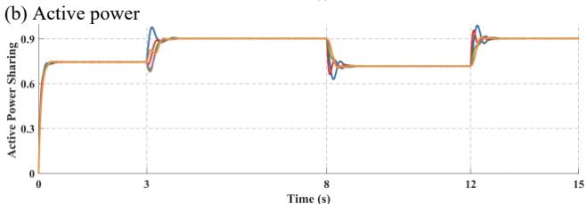  
(c) Active power sharing $( k _ { i } ^ { P } P _ { i } )$  
Fig. 3. Control performance without CTDs.

The simulation results show that when the system operates solely under droop control in the first , active power sharing is achieved, but there is a significant deviation in frequency. After the secondary control is activated, the system frequency and active power quickly converge to the rated values within , which verifies the effectiveness of DSC for frequency restoration and active power sharing. When Load 6 is disconnected at and reconnected at , the active power of each DG is redistributed within .s The frequency returns to stability within after a brief deviation, indicating that the algorithm has strong adaptability to load changes, can effectively maintain power balance and frequency stability, and demonstrates good robustness.

## Scenario 2: Considering the Influence of CTDs.

A CTD variable is introduced under the same conditions as in Scenario 1. Fig. 4 and Fig. 5 illustrate the operation status of the system when the CTD is less than the theoretical CTD margin, while Fig. 6 shows the situation when the CTD exceeds this margin.

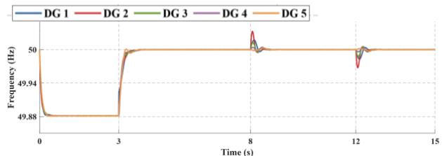

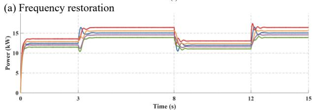

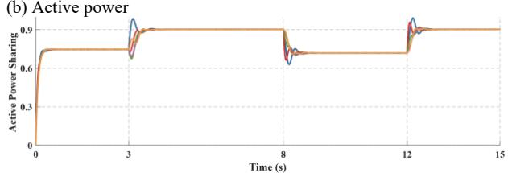  
(c) Active power sharing $( k _ { i } ^ { P } P _ { i } )$  
Fig. 4. Control performance at $\tau = 5$ ms

(b) Active power  
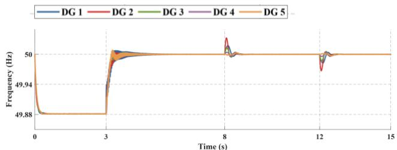

(a) Frequency restoration  
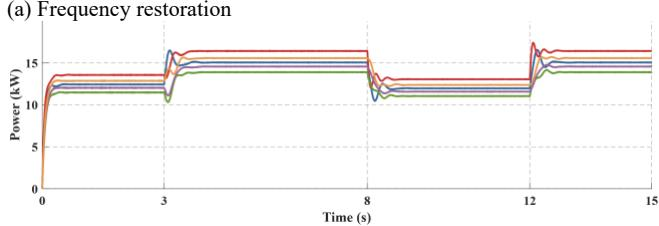

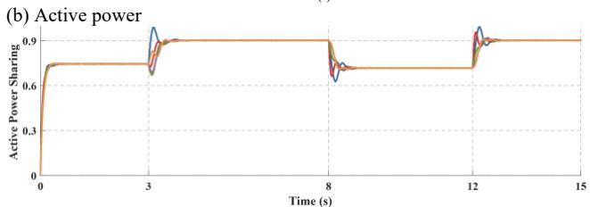  
(c) Active power sharing $( k _ { i } ^ { P } P _ { i } )$

Fig. 5. Control performance at $\tau = 7 . 5$ ms  
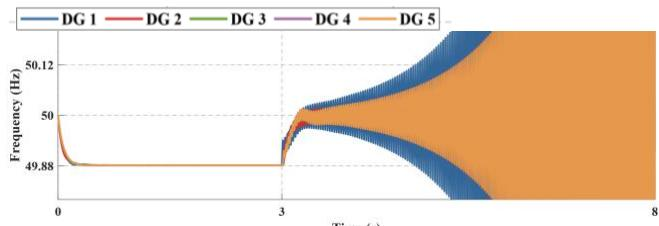

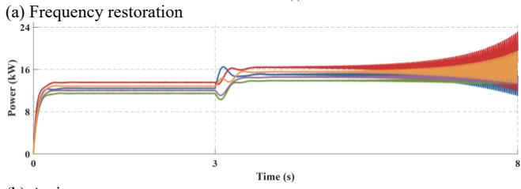  
Fig. 6. Control performance at $\tau = 7 . 7$ ms

The results indicate that after introducing the CTD variable, when the delay is less than the theoretical CTD margin ( ), as depicted in Fig. 4 and Fig. 5, although the active power adjustment and frequency restoration time increase slightly compared to the no-delay scenario, the system does not exhibit oscillations or lose control and can still operate stably. This validates the adaptability and tolerance of the algorithm within the theoretical CTD margin. As shown in Fig. 6, when the CTD exceeds the theoretical margin, the system stability decreases significantly, the power oscillation intensifies, and the frequency restoration time prolongs, suggesting that  is the critical threshold for maintaining system stability, which aligns with the theoretically derived CTD margin.

## Scenario 3: Plug-and-Play Experiment.

As shown in Fig. 7, the secondary control is initiated at 3 s . DG 5 is cut out at  and re-inserted at  to simulate the variation of distributed DGs.

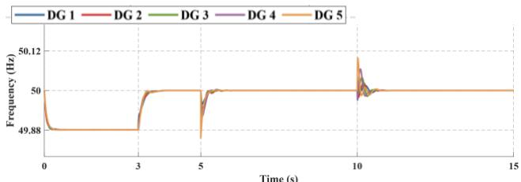

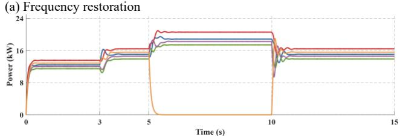

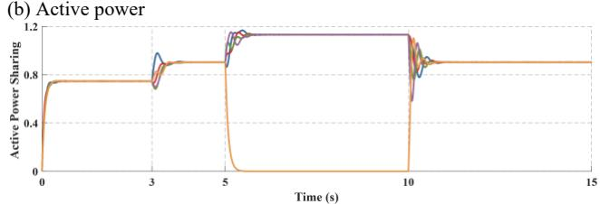  
(c) Active power sharing $( k _ { i } ^ { P } P _ { i } )$  
Fig. 7. Control Performance on Plug-and-Play

The simulation results show that, as depicted in Fig. 7, after DG 5 is cut out at  , the active power of other DGs is rapidly redistributed. Although the frequency deviates slightly, it remains within a controllable range. At  , when DG 5 is re-inserted, the system quickly adapts: active power sharing is readjusted and frequency recovers steadily. This demonstrates that the control strategy can effectively cope with the plug-and-play of DGs, maintain active power balance and frequency stability, thus verifying the adaptability and reliability of the control method for changes in DGs.

## V. CONCLUSIONS

Aiming at the problems of frequency restoration, active power sharing and CTD in islanded MGs, this paper designs a DSC and verifies its effectiveness, robustness through theoretical analysis and simulation experiments. The main conclusions are as follows: By means of the design of a consensus protocol and reference tracking terms, the designed DSC achieves frequency restoration and active power sharing. It can quickly redistribute power and restore the frequency when load switching occurs, and maintain stable operation within a certain range of CTDs, verifying the robustness of the algorithm. When the CTDs exceed the theoretical margin, it will intensify power oscillations and prolong the frequency restoration time, indicating that this margin is a key threshold for maintaining stability and provides constraints for controller parameter design; through Scenario 3, the adaptability and reliability of the DSC for the plug-and-play of DGs are further verified. Compared with centralized control, the DSC avoids the problems of singlepoint failure and poor plug-and-play compatibility, and can more flexibly and efficiently adapt to the dynamic connection and disconnection of DGs, ensuring the stable operation of the MGs.

Although the DSC strategy proposed in this paper has been verified by theoretical analysis and simulation to confirm its robustness to CTDs, loads and DGs variations, as well as the effectiveness of its control performance, multiple challenges still exist in practical engineering implementation, such as communication failures caused by malicious cyberattacks, limitations imposed by high deployment and maintenance costs, etc. In the future, the comprehensive impacts of various factors can be deeply explored to more comprehensively enhance the adaptability and reliability of this control strategy in practical engineering.

## REFERENCES

[1] JANSEN P, SCHOOR G V, UREN K R. Load-profile based sizing method for distributed energy resources in industrial microgrids[C]//33rd Southern African Universities Power Engineering Conference, SAUPEC 2025, January 29, 2025-January 30, 2025, Pretoria, South Africa, 2025.

[2] NEGI G S, GUPTA M K, SAXENA N K, et al. Empowering sustainability and resilience: The prominence of microgrids in a decentralized energy future[C]//2nd International Conference on Sustainable Computing and Smart Systems, ICSCSS 2024, July 10, 2024-July 12, 2024, Coimbatore, India, 2024: 25-31.

[3] SHAHAB M T, ABBAS S Z, USMAN A. A simplified protection scheme for renewable energy integrated ac microgrids[C]//1st IEEE Karachi Section Humanitarian Technology Conference, Khi-HTC 2024, January 8, 2024-January 9, 2024, Tandojam, Pakistan, 2024.

[4] SHAN Y, MA L, LIU H, et al. Coordinated hierarchical control strategy for islanded ac/dc hybrid microgrids[C]//2022 Asia Power and Electrical Technology Conference, APET 2022, November 11, 2022- November 13, 2022, Virtual, Online, China, 2022: 132-137.

[5] VILAISARN Y, MORADZADEH M, ABDELAZIZ M, et al. 2022. An milp formulation for the optimum operation of ac microgrids with hierarchical control[J]. International Journal of Electrical Power and Energy Systems, 2022, 137.

[6] LU F, LIU H. 2022. An accurate power flow method for microgrids with conventional droop control[J]. Energies, 2022, 15(16).

[7] NI J, ZHAO B, GOUDARZI A, et al. 2022. A dispatchable droop control method for pv systems in dc microgrids [M]. SSRN.

[8] LI R, LIU S, XIA M, et al. 2020. Analysis of effects of communication conditions on distributed secondary control for dc microgrids [M]. 2020 IEEE 9th International Power Electronics and Motion Control Conference (IPEMC2020-ECCE Asia): 2933-2938.

[9] TAHER M A, TARIQ M, SARWAT A I. 2023. Analyzing the effects of interference and packet loss on consensus-based secondary control in islanded ac microgrid [M]. 2023 IEEE Design Methodologies Conference (DMC): 1-6.

[10] CHANTOLA A, SHARMA V, SINGH D. Centralized secondary control strategy on droop controlled inverter-based microgrid[C]//2nd IEEE International Conference on Measurement, Instrumentation, Control and Automation, ICMICA 2023, May 3, 2024-May 5, 2024, Kurukshetra, India, 2024.

[11] YINPING W, RONGHAO W, XIA Q. 2022. Distributed eventtriggered secondary coordinated control of microgrid based on disturbance observer [M]. 2022 34th Chinese Control and Decision Conference (CCDC): 911-916.

[12] LIU X, YAN J, ZHANG X, et al. Distributed finite- time secondary voltage control of microgrid[C]//42nd Chinese Control Conference, CCC 2023, July 24, 2023-July 26, 2023, Tianjin, China, 2023: 7261- 7266.

[13] AMRR S M, ALI M, ABUSHOKOR A, et al. Distributed secondary

frequency regulation in ac microgrid with arbitrary convergence time control[C]//2024 IEEE Sustainable Power and Energy Conference, iSPEC 2024, November 24, 2024-November 27, 2024, Kuching, Malaysia, 2024: 646-651.

[14] WU J, GUO F, BOEM F. Decentralised-distributed secondary frequency restoration and power sharing control for microgrid clusters[C]//2024 European Control Conference, ECC 2024, June 25, 2024-June 28, 2024, Stockholm, Sweden, 2024: 279-284.

[15] YANG C, ZHENG T, LI P, et al. 2024. Distributed secondary control of hybrid ac/dc microgrid based on improved model-free adaptive control[J]. Zhongguo Dianji Gongcheng Xuebao/Proceedings of the Chinese Society of Electrical Engineering, 2024, 44(1): 34-45.

[16] ANNAVARAM D, MISHRA S. Distributed secondary control for dc microgrid with reduced communication variables[C]//6th IEEE Global Power, Energy and Communication Conference, GPECOM 2024, June 4, 2024-June 7, 2024, Budapest, Hungary, 2024: 455-460.

[17] LI L, WU Z, ZHANG H, et al. 2025. Distributed secondary control strategy for the islanded dc microgrid based on virtual dc machine control[J]. Journal of Applied Science and Engineering, 2025, 28(5): 1041-1054.

[18] MOSAAD N, ABDEL-RAHIM O, MEGAHED T F, et al. Detection of false data injection on distributed secondary control in dc islanded microgrid[C]//24th International Middle East Power System Conference, MEPCON 2023, December 19, 2023-December 21, 2023, Mansoura, Egypt, 2023.

[19] SU Q, FAN H, LI J. 2023. Distributed adaptive secondary control of ac microgrid under false data injection attack[J]. Electric Power Systems Research, 2023, 223.

[20] ZHONG C, ZHAO H, LIU Y, et al. 2024. Model predictive secondary frequency control of island microgrid based on two-layer movinghorizon estimation observer[J]. Applied Energy, 2024, 372.

[21] HUANG X, ZENG J, WANG T, et al. 2025. An off-policy maximum entropy deep reinforcement learning method for data-driven secondary frequency control of island microgrid[J]. Applied Soft Computing, 2025, 170.

[22] ARUNIMA S, SUBUDHI B. Dynamic event-triggered distributed secondary control for a microgrid considering time-delay and disturbances[C]//49th Annual Conference of the IEEE Industrial Electronics Society, IECON 2023, October 16, 2023-October 19, 2023, Singapore, Singapore, 2023.

[23] QIN C, ZHANG J, PANG S, et al. 2024. A novel event-triggered secondary control strategy for microgrid considering time-varying delay[J]. International Journal of Electrical Power and Energy Systems, 2024, 162.

[24] YUAN D, LU Z, CHEN X, et al. 2023. Assessment-predictionregulation coordinated secondary control strategy for microgrid considering large time-delay[J]. Electric Power Systems Research, 2023, 225.

[25] ZHANG Q, SUN J. Dos attack intensity adaptive actor-critic scheme for distributed secondary control of dc microgrid under digital quantization[C]//43rd Chinese Control Conference, CCC 2024, July 28, 2024-July 31, 2024, Kunming, China, 2024: 5219-5224.

[26] WU Z, GENG S, XIE Z. 2024. Event triggering fixed time secondary control of dc microgrid considering fdi attacks[J]. International Journal of Adaptive Control and Signal Processing, 2024, 38(10): 3311-3328.

[27] PAUDEL A, MANDAL P, RAVIKUMAR G. Resilience assessment of cyber-attacks on distributed secondary control in microgrid[C]//56th North American Power Symposium, NAPS 2024, October 13, 2024- October 15, 2024, El Paso, TX, United states, 2024.